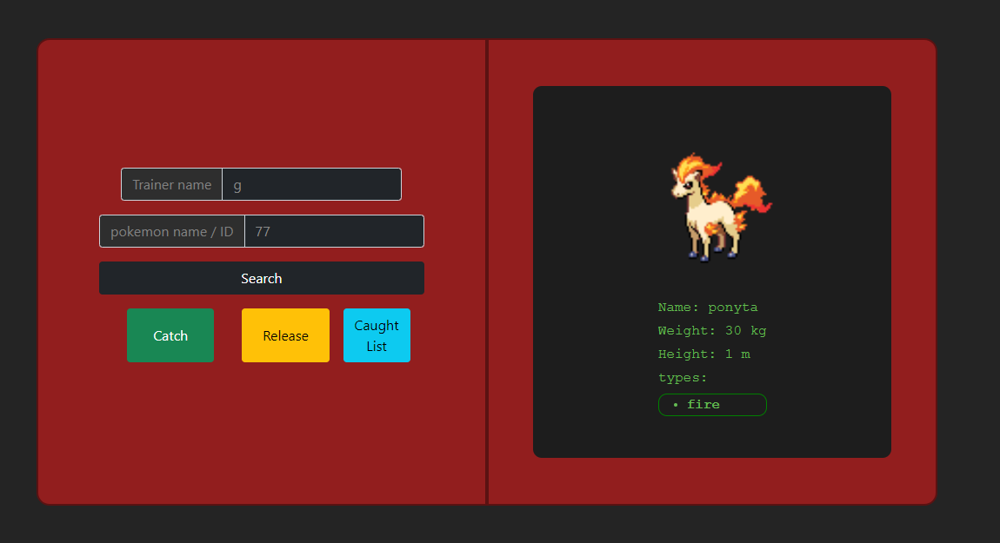

# pokedex-heroku

The famous pokedex we all know, but wait- now it's fully deployed on heroku!  
INCLUDING THE FRONTEND  
AAAAND THE BACKEND!!!  
 

## Use

Search your favorite pokemon by entering a pokemon name or an ID in the search box.
hit search.  
to see more pokemons of a type, click that type, and a modal will appear.  
click on any of the pokemons in the list to see info about it.

### Catching

To catch a pokemon, you must first enter your trainer name.  
only after that, you may search for a pokemon to catch.  
To catch it, simply click the _catch_ button.

### Releasing

Releasing a pokemon is as easy as catching one.  
Search for the pokemon you'd want to release, and click the release button.

### Catch list

Did you already catch them all?  
You can see all the pokemons you already caught by clicking the _Caught list_ button.
